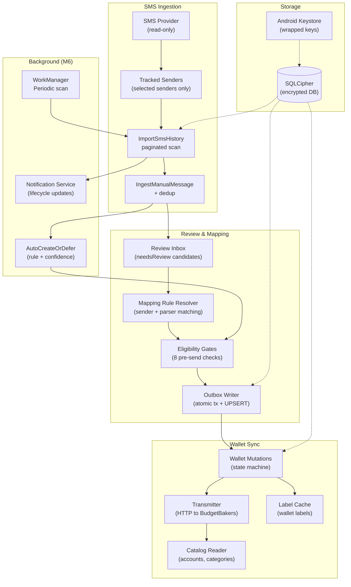

<div align="center">

# MoneySync

**Android-first, local-first Flutter app for tracking financial SMS and syncing approved transactions with [BudgetBakers Wallet](https://budgetbakers.com/).**

Reads bank SMS from selected senders, interprets transactions, and creates records in your Wallet — all on-device, all encrypted.

[](https://flutter.dev)
[](https://dart.dev)
[](https://developer.android.com)
[](./LICENSE)


</div>

---

## What MoneySync Does

MoneySync watches your bank SMS, lets you configure which senders to track, interprets transaction messages into structured data, and creates records in BudgetBakers Wallet after your review — or automatically when rules are configured.

**Nothing leaves your phone until you approve it.** All data lives in an encrypted SQLCipher database. Wallet API calls only happen when you tap "Create" or when an auto-create rule matches with high confidence.

---

## Architecture

```
┌──────────────────────────────────────────────────────────────────┐
│ PRESENTATION   Material 3 · Riverpod notifiers · go_router       │
├──────────────────────────────────────────────────────────────────┤
│ APPLICATION    ImportSmsHistory · ReviewTransactionUseCase ·      │
│                AutoCreateOrDefer · ScanTrackedSenders ·           │
│                WalletMutationTransmitter                         │
├──────────────────────────────────────────────────────────────────┤
│ DOMAIN         Money · MappingRuleResolver · PreSendGate chain · │
│                WalletMutationState machine · RetryScheduler      │
│                (pure Dart — no Flutter/Drift/Dio/Pigeon)         │
├──────────────────────────────────────────────────────────────────┤
│ DATA           Drift + SQLCipher · WalletMutationsDao ·          │
│                HttpWalletApiDataSource + FakeDataSource ·         │
│                Keystore secret store                             │
├──────────────────────────────────────────────────────────────────┤
│ NATIVE         Kotlin: SMS delegates · ShareIntentHandler ·      │
│                NativeSecurityChannel · Pigeon bridges (4 APIs)   │
└──────────────────────────────────────────────────────────────────┘
        dependency rule: presentation → domain ← data
```

### High-Level Components



---

## Features

### SMS Ingestion (Selected Senders Only)

MoneySync only reads SMS from senders you explicitly configure under **Settings > Tracked Senders**. It never reads your full inbox.

- Manual history scan — import past messages on demand
- Automatic periodic scan (M6) — WorkManager background job, 15-minute interval
- Privacy-epoch guard — writes validated against the current privacy epoch
- Deduplication via HMAC-based `source_key` — never duplicates the same message

### Mapping Rules

Define how senders map to Wallet accounts and categories:

- **Sender matching** — pick from configured tracked senders (no free-text mismatch)
- **Parser families** — rule packs for different bank SMS formats
- **Sync modes** — manual (review required) or automatic (confidence-gated create)
- **Confidence floor** — minimum basis points required for auto-create (default 9000)
- Resolver uses 4-rank precedence: exact sender + parser + merchant + instrument

### Review Inbox

Candidates that don't auto-create land here for your review:

- Editable transaction panel — adjust amount, date, category, account
- Pre-send eligibility gates — 8 fixed-order checks before any Wallet write
- Atomic outbox write — single-transaction, lineage pre-check, UPSERT dedup
- Batched activity events — every action recorded in the activity log

### Wallet Configuration

Connect to BudgetBakers Wallet and manage your accounts:

- Catalog reader — fetches accounts and categories (GET-only, HTTPS host-pinned)
- Auto-connect at startup — connects if credentials exist
- Account picker — filter to eligible (writable) accounts only
- Label cache — wallet labels cached locally for display
- Counterparty auto-fill — extracted from SMS parser output

### Activity Events

Your personal record of what MoneySync did — not a developer log:

- Wallet connected/refreshed
- Transaction reviewed, queued, created, or failed
- Message imported or rejected
- Mapping rule created
- Structurally redacted — no SMS body, tokens, or raw amounts in activity text

### Security & Privacy

- **Encrypted database** — whole-DB SQLCipher, Keystore-wrapped keys
- **Secure window** — FLAG_SECURE by default
- **Capability-gated** — dangerous features off by default, enabled per-milestone
- **No secrets in code** — tokens only in Android Keystore-backed storage
- **Redaction guards** — two independent redaction layers (activity + log)
- **Biometric lock** — local_auth with device credential fallback

---

## Build Flavors

| Flavor | SMS Access | Auto-import | Use Case |
|--------|-----------|-------------|----------|
| `privateFull` | `READ_SMS` granted | Periodic scan enabled | Full tracking on personal device |
| `playManual` | No SMS permission | Not available | Manual paste/share only, Play Store ready |

```bash
# privateFull
flutter build apk --debug --flavor privateFull --target lib/main_private_full.dart

# playManual
flutter build apk --debug --flavor playManual --target lib/main_play_manual.dart
```

---

## Quick Start

```bash
# Get dependencies
cd money_sync
flutter pub get

# Verify
dart format --output=none --set-exit-if-changed .
flutter analyze
flutter test --coverage --branch-coverage

# Build both flavors
flutter build apk --debug --flavor privateFull --target lib/main_private_full.dart
flutter build apk --debug --flavor playManual --target lib/main_play_manual.dart

# Permission boundary check
bash tool/verify_android_permissions.sh
```

---

## Project Structure

```
lib/
  app/                 # App, router (go_router), theme
  bootstrap/           # Composition roots, providers, startup flow
  core/
    capabilities/      # AppCapability enum + sets
    crypto/            # HMAC, identity signing
    database/          # Drift schema (v15), SQLCipher opener
    logging/           # package:logging + redaction
    money/             # Integer minor units, currency
    privacy/           # Redaction policies
    security/          # Keystore, secure storage
  features/
    onboarding/        # Privacy + permission flow
    sms_permission/    # READ_SMS gate
    sms_ingestion/     # Import pipeline + background scan
    sms_tracking/      # Tracked senders
    review_inbox/      # Candidate review + 8-gate eligibility
    mappings/          # Rule resolver + editor UI
    transaction_parser/# Rule packs (bank SMS interpretation)
    wallet_connection/ # Catalog reader + account cache
    wallet_sync/       # State machine + transmitter + views
    activity_log/      # User-facing action history
    dashboard/         # Home screen health + tiles
    settings/          # Configuration pages
    data_control/      # Data management
    lock/              # Biometric lock screen
```

---

## Contributing

See [AGENTS.md](./AGENTS.md) for the full development workflow, architecture rules, testing requirements, and device deployment procedures.

**Key rules:**
- Domain must be pure Dart (no Flutter/Drift/Dio/Pigeon imports)
- Never use `double` for money — integer minor units with explicit currency
- Never log SMS bodies, tokens, or raw merchant strings
- Run `dart format` + `flutter analyze` before every commit
- Test on a real device for UI/navigation/permission changes

---

## License

Private — not for distribution. See repository owner for access.
