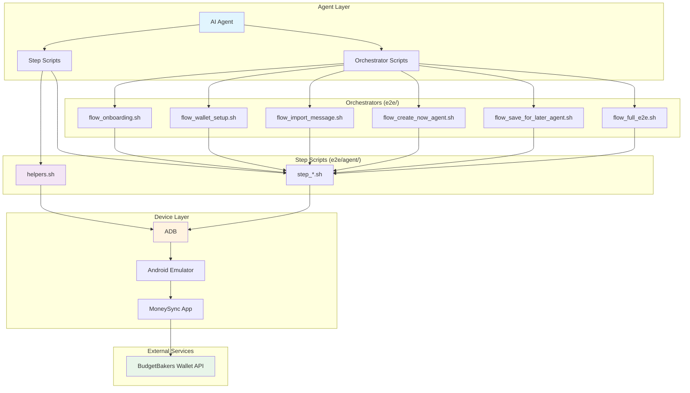
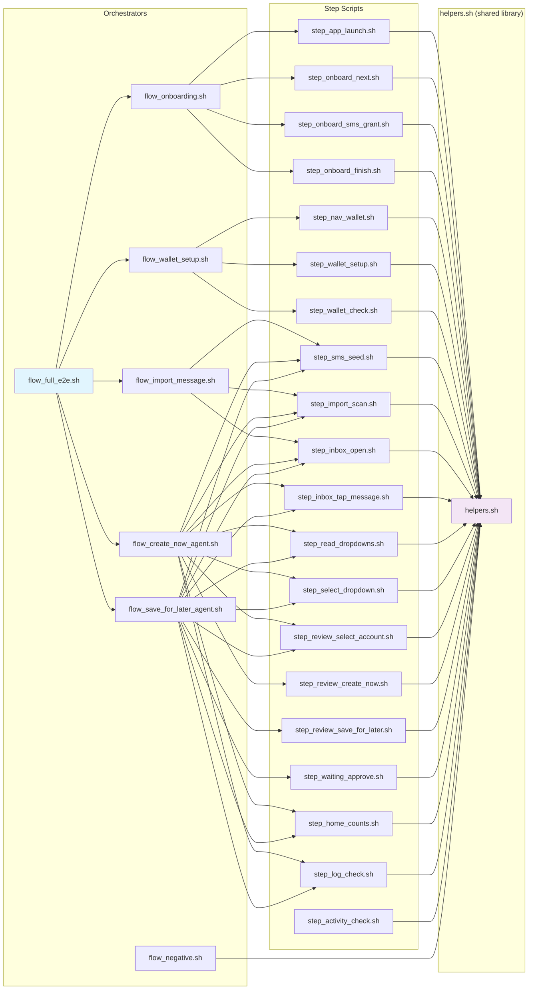
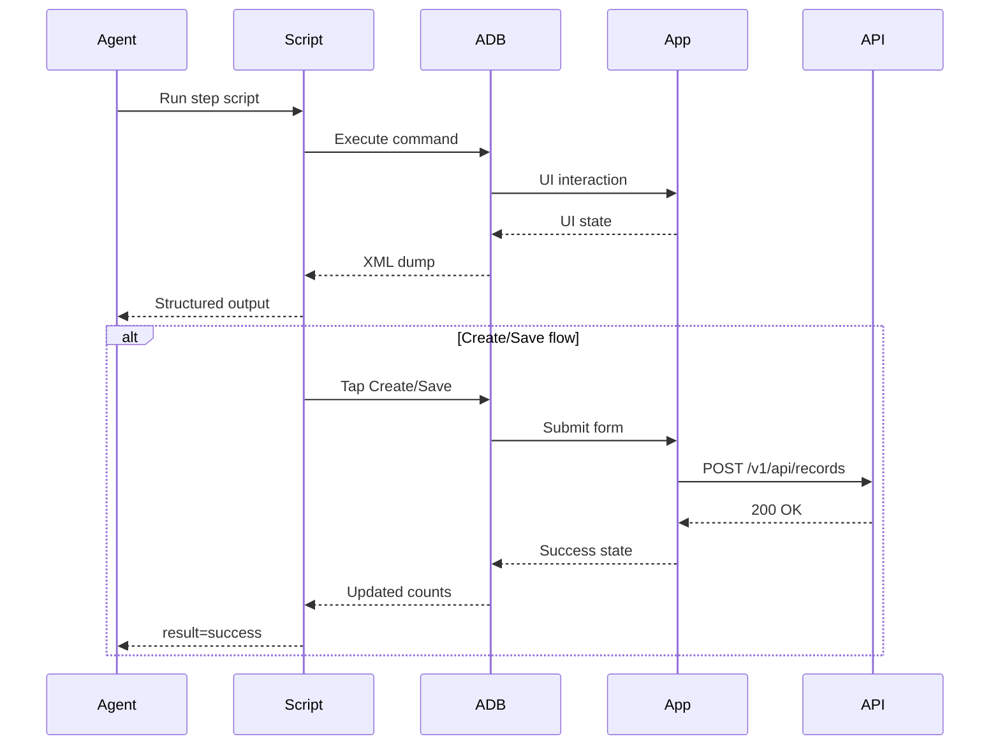

# MoneySync E2E Architecture
<iframe src="./architecture.html" width="100%" height="500px" style="border:none;"></iframe>

## System Architecture

```mermaid
graph TB
    subgraph "Agent Layer"
        A[AI Agent] --> B[Step Scripts]
        A --> C[Orchestrator Scripts]
    end

    subgraph "Step Scripts (e2e/agent/)"
        B --> D[helpers.sh]
        B --> E[step_*.sh]
    end

    subgraph "Orchestrators (e2e/)"
        C --> F[flow_onboarding.sh]
        C --> G[flow_wallet_setup.sh]
        C --> H[flow_import_message.sh]
        C --> I[flow_create_now_agent.sh]
        C --> J[flow_save_for_later_agent.sh]
        C --> K[flow_full_e2e.sh]
    end

    subgraph "Device Layer"
        E --> L[ADB]
        L --> M[Android Emulator]
        M --> N[MoneySync App]
    end

    subgraph "External Services"
        N --> O[BudgetBakers Wallet API]
    end

    D --> L
    F --> E
    G --> E
    H --> E
    I --> E
    J --> E
    K --> E

    style A fill:#e1f5fe
    style D fill:#f3e5f5
    style L fill:#fff3e0
    style O fill:#e8f5e9
```

## Script Dependency Graph

```mermaid
graph LR
    subgraph "helpers.sh (shared library)"
        H[helpers.sh]
    end

    subgraph "Step Scripts"
        S1[step_app_launch.sh]
        S2[step_onboard_next.sh]
        S3[step_onboard_sms_grant.sh]
        S4[step_onboard_finish.sh]
        S5[step_nav_wallet.sh]
        S6[step_wallet_setup.sh]
        S7[step_wallet_check.sh]
        S8[step_sms_seed.sh]
        S9[step_import_scan.sh]
        S10[step_inbox_open.sh]
        S11[step_inbox_tap_message.sh]
        S12[step_read_dropdowns.sh]
        S13[step_select_dropdown.sh]
        S14[step_review_select_account.sh]
        S15[step_review_create_now.sh]
        S16[step_review_save_for_later.sh]
        S17[step_waiting_approve.sh]
        S18[step_home_counts.sh]
        S19[step_log_check.sh]
        S20[step_activity_check.sh]
    end

    subgraph "Orchestrators"
        O1[flow_onboarding.sh]
        O2[flow_wallet_setup.sh]
        O3[flow_import_message.sh]
        O4[flow_create_now_agent.sh]
        O5[flow_save_for_later_agent.sh]
        O6[flow_full_e2e.sh]
        O7[flow_negative.sh]
    end

    S1 --> H
    S2 --> H
    S3 --> H
    S4 --> H
    S5 --> H
    S6 --> H
    S7 --> H
    S8 --> H
    S9 --> H
    S10 --> H
    S11 --> H
    S12 --> H
    S13 --> H
    S14 --> H
    S15 --> H
    S16 --> H
    S17 --> H
    S18 --> H
    S19 --> H
    S20 --> H

    O1 --> S1
    O1 --> S2
    O1 --> S3
    O1 --> S4
    O2 --> S5
    O2 --> S6
    O2 --> S7
    O3 --> S8
    O3 --> S9
    O3 --> S10
    O4 --> S8
    O4 --> S9
    O4 --> S10
    O4 --> S11
    O4 --> S12
    O4 --> S13
    O4 --> S14
    O4 --> S15
    O4 --> S18
    O4 --> S19
    O5 --> S8
    O5 --> S9
    O5 --> S10
    O5 --> S11
    O5 --> S12
    O5 --> S13
    O5 --> S14
    O5 --> S16
    O5 --> S17
    O5 --> S18
    O5 --> S19
    O6 --> O1
    O6 --> O2
    O6 --> O3
    O6 --> O4
    O6 --> O5
    O7 --> H

    style H fill:#f3e5f5
    style O6 fill:#e1f5fe
```

## Data Flow

```mermaid
sequenceDiagram
    participant Agent
    participant Script
    participant ADB
    participant App
    participant API

    Agent->>Script: Run step script
    Script->>ADB: Execute command
    ADB->>App: UI interaction
    App-->>ADB: UI state
    ADB-->>Script: XML dump
    Script-->>Agent: Structured output

    alt Create/Save flow
        Script->>ADB: Tap Create/Save
        ADB->>App: Submit form
        App->>API: POST /v1/api/records
        API-->>App: 200 OK
        App-->>ADB: Success state
        ADB-->>Script: Updated counts
        Script-->>Agent: result=success
    end
```
