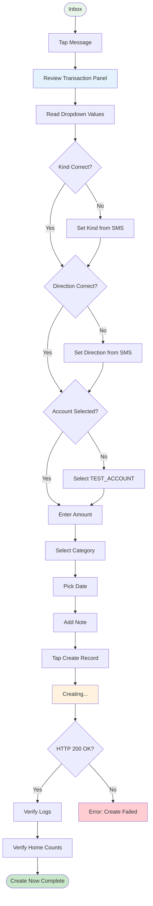

# Create Now Flow

## Step Details

| Step | Script | Action | Output |
|------|--------|--------|--------|
| 1 | `step_inbox_tap_message.sh [text]` | Open message | `screen=review_panel` |
| 2 | `step_read_dropdowns.sh` | Read fields | `dropdown=kind`, `current_value=` |
| 3 | `step_select_dropdown.sh kind income` | Set kind | `status=selected` |
| 4 | `step_select_dropdown.sh direction credit` | Set direction | `status=selected` |
| 5 | `step_review_select_account.sh` | Pick TEST_ACCOUNT | `account=TEST_ACCOUNT` |
| 6 | Type amount | Enter value | — |
| 7 | `step_select_dropdown.sh category "All Income"` | Pick category | `status=selected` |
| 8 | `step_select_dropdown.sh date` | Pick date | `status=selected` |
| 9 | `step_review_create_now.sh` | Create record | `result=success` |
| 10 | `step_home_counts.sh` | Verify counts | `{"success":N}` |
| 11 | `step_log_check.sh` | Verify logs | `found=true` |

## SMS to Field Mapping

| SMS Pattern | Kind | Direction |
|-------------|------|-----------|
| "credited with" | income | credit |
| "debited from" | expense | debit |
| "transferred" | transfer | neutral |
