# Full E2E Flow

```mermaid
flowchart TD
    Start([Start E2E]) --> Onboarding[Phase 1: Onboarding]
    Onboarding --> Wallet[Phase 2: Wallet Setup]
    Wallet --> Import[Phase 3: Import Message]
    Import --> CreateNow[Phase 4: Create Now]
    CreateNow --> SaveLater[Phase 5: Save for Later]
    SaveLater --> Done([E2E Complete])

    subgraph "Phase 1: Onboarding"
        O1[Launch App] --> O2[Tap Next ×6]
        O2 --> O3[Grant SMS Permission]
        O3 --> O4[Tap Finish]
        O4 --> O5[Navigate to Home]
    end

    subgraph "Phase 2: Wallet Setup"
        W1[Navigate to Settings] --> W2[Enter API Token]
        W2 --> W3[Tap Save & Connect]
        W3 --> W4[Validate TEST_ACCOUNT]
        W4 --> W5{Account Found?}
        W5 -->|Yes| W6[Wallet Connected]
        W5 -->|No| W7[STOP: Create Account]
    end

    subgraph "Phase 3: Import Message"
        I1[Seed SMS] --> I2[Run History Scan]
        I2 --> I3[Open Inbox]
        I3 --> I4[Verify Messages]
    end

    subgraph "Phase 4: Create Now"
        C1[Tap Message] --> C2[Read Fields]
        C2 --> C3[Fix Kind/Direction]
        C3 --> C4[Select TEST_ACCOUNT]
        C4 --> C5[Enter Amount]
        C5 --> C6[Select Category]
        C6 --> C7[Pick Date]
        C7 --> C8[Tap Create Record]
        C8 --> C9[Verify Success]
    end

    subgraph "Phase 5: Save for Later"
        S1[Tap Message] --> S2[Read Fields]
        S2 --> S3[Fix Kind/Direction]
        S3 --> S4[Select TEST_ACCOUNT]
        S4 --> S5[Enter Amount]
        S5 --> S6[Select Category]
        S6 --> S7[Pick Date]
        S7 --> S8[Tap Save for Later]
        S8 --> S9[Verify Waiting=1]
        S9 --> S10[Open Waiting Queue]
        S10 --> S11[Tap Mutation]
        S11 --> S12[Tap Approve]
        S12 --> S13[Verify Success]
    end

    style Start fill:#e8f5e9
    style Done fill:#c8e6c9
    style W7 fill:#ffcdd2
    style Onboarding fill:#e3f2fd
    style Wallet fill:#fff3e0
    style Import fill:#f3e5f5
    style CreateNow fill:#e8f5e9
    style SaveLater fill:#e0f7fa
```



## Execution Command

```bash
bash e2e/flow_full_e2e.sh <wallet_token> SAMPATHTX
```

## Verification Points

| Phase | Check | Script |
|-------|-------|--------|
| Onboarding | Home screen visible | `step_screen_dump.sh` |
| Wallet | Connected + TEST_ACCOUNT found | `step_wallet_check.sh` |
| Import | Messages in inbox | `step_inbox_open.sh` |
| Create Now | Success count incremented | `step_home_counts.sh` |
| Create Now | HTTP 200 OK in logs | `step_log_check.sh` |
| Save for Later | Waiting count incremented | `step_home_counts.sh` |
| Save for Later | Success count incremented | `step_home_counts.sh` |
| Save for Later | Activity log entry | `step_activity_check.sh` |
