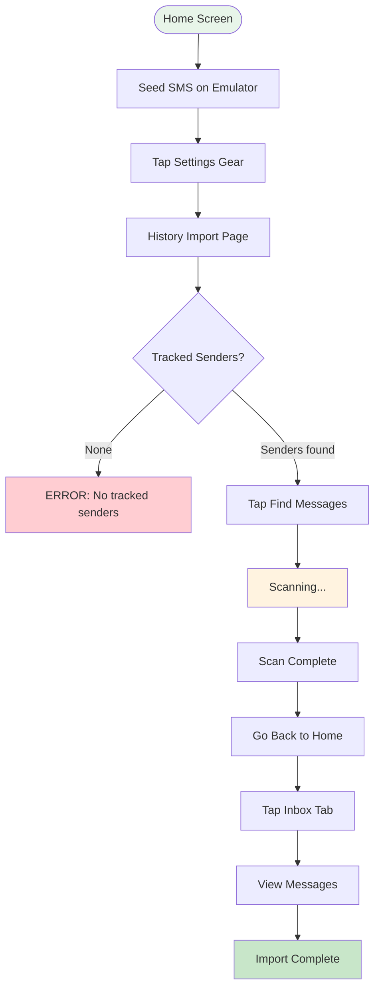

# Import Message Flow

## Step Details

| Step | Script | Action | Output |
|------|--------|--------|--------|
| 1 | `step_sms_seed.sh [sender] [body]` | Seed SMS | `sender=`, `body=` |
| 2 | `step_import_ensure_sender.sh [name]` | Check senders | `status=already_listed` |
| 3 | `step_import_scan.sh` | Run scan | `action=scan_complete` |
| 4 | `step_inbox_open.sh` | Open inbox | `message_count=N` |

## Scan Results

- `stored` — new messages imported
- `not recognised` — SMS not matching any parser
- `already imported` — duplicate messages skipped
