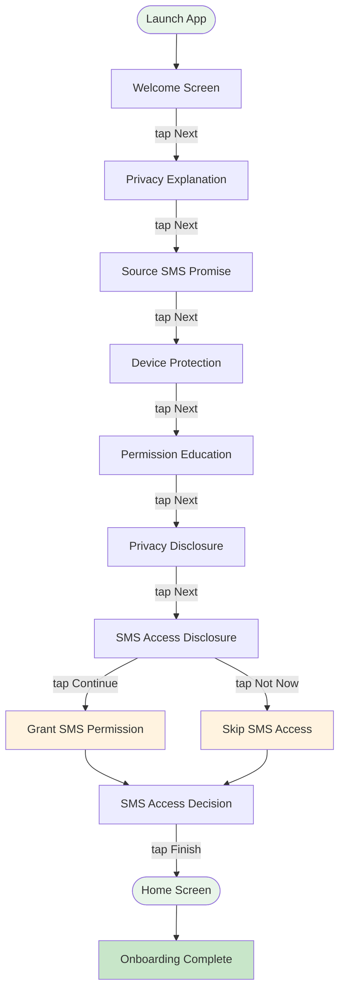

# Onboarding Flow

## Step Details

| Step | Script | Action | Output |
|------|--------|--------|--------|
| 1 | `step_app_launch.sh` | Launch app | `screen=onboarding` |
| 2-7 | `step_onboard_next.sh` ×6 | Tap Next | `current_step=` |
| 8 | `step_onboard_sms_grant.sh` | Grant SMS | `action=granted_via_adb` |
| 9 | `step_onboard_finish.sh` | Finish | `action=onboarding_complete` |
| 10 | `step_onboard_dismiss_review.sh` | Dismiss | `screen=home` |
