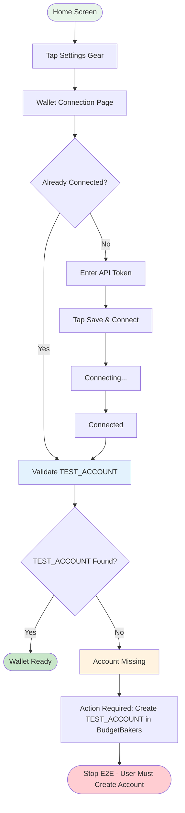

# Wallet Setup Flow

## Step Details

| Step | Script | Action | Output |
|------|--------|--------|--------|
| 1 | `step_nav_wallet.sh` | Navigate to wallet | `screen=wallet_connection` |
| 2 | `step_wallet_setup.sh [token]` | Enter token | `wallet_status=connected` |
| 3 | `step_wallet_check.sh` | Validate | `test_account=found\|missing` |

## TEST_ACCOUNT Validation

After wallet connects, `step_wallet_check.sh` automatically:
1. Checks if `TEST_ACCOUNT` exists in the account list
2. Scrolls up to 5 times to find it
3. If missing: outputs `test_account=missing` and exits with error
4. Agent must ask user to create the account before proceeding
