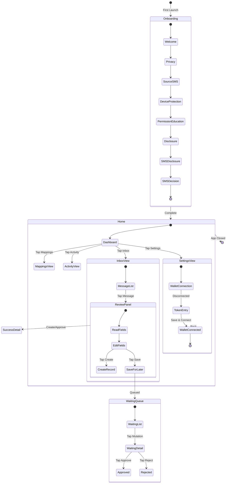
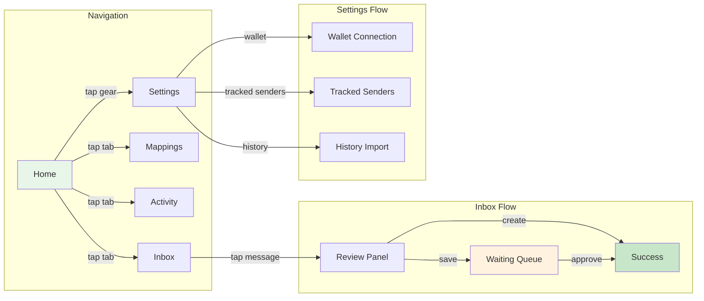

# App State Machine

```mermaid
stateDiagram-v2
    [*] --> Onboarding: First Launch

    state Onboarding {
        [*] --> Welcome
        Welcome --> Privacy
        Privacy --> SourceSMS
        SourceSMS --> DeviceProtection
        DeviceProtection --> PermissionEducation
        PermissionEducation --> Disclosure
        Disclosure --> SMSDisclosure
        SMSDisclosure --> SMSDecision
        SMSDecision --> [*]
    }

    Onboarding --> Home: Complete

    state Home {
        [*] --> Dashboard
        Dashboard --> InboxView: Tap Inbox
        Dashboard --> MappingsView: Tap Mappings
        Dashboard --> ActivityView: Tap Activity
        Dashboard --> SettingsView: Tap Settings
    }

    state InboxView {
        [*] --> MessageList
        MessageList --> ReviewPanel: Tap Message
    }

    state ReviewPanel {
        [*] --> ReadFields
        ReadFields --> EditFields
        EditFields --> CreateRecord: Tap Create
        EditFields --> SaveForLater: Tap Save
    }

    state WaitingQueue {
        [*] --> WaitingList
        WaitingList --> WaitingDetail: Tap Mutation
        WaitingDetail --> Approved: Tap Approve
        WaitingDetail --> Rejected: Tap Reject
    }

    ReviewPanel --> SuccessDetail: Create/Approve
    SaveForLater --> WaitingQueue: Queued

    state SettingsView {
        [*] --> WalletConnection
        WalletConnection --> TokenEntry: Disconnected
        TokenEntry --> WalletConnected: Save & Connect
        WalletConnected --> [*]
    }

    WalletConnected --> Home: Back

    Home --> [*]: App Closed
```

## Screen Transitions

```mermaid
flowchart LR
    subgraph "Navigation"
        Home[Home] -->|tap tab| Inbox[Inbox]
        Home -->|tap tab| Mappings[Mappings]
        Home -->|tap tab| Activity[Activity]
        Home -->|tap gear| Settings[Settings]
    end

    subgraph "Inbox Flow"
        Inbox -->|tap message| Review[Review Panel]
        Review -->|create| Success[Success]
        Review -->|save| Waiting[Waiting Queue]
        Waiting -->|approve| Success
    end

    subgraph "Settings Flow"
        Settings -->|wallet| WalletConn[Wallet Connection]
        Settings -->|tracked senders| Senders[Tracked Senders]
        Settings -->|history| History[History Import]
    end

    style Home fill:#e8f5e9
    style Success fill:#c8e6c9
    style Waiting fill:#fff3e0
```
