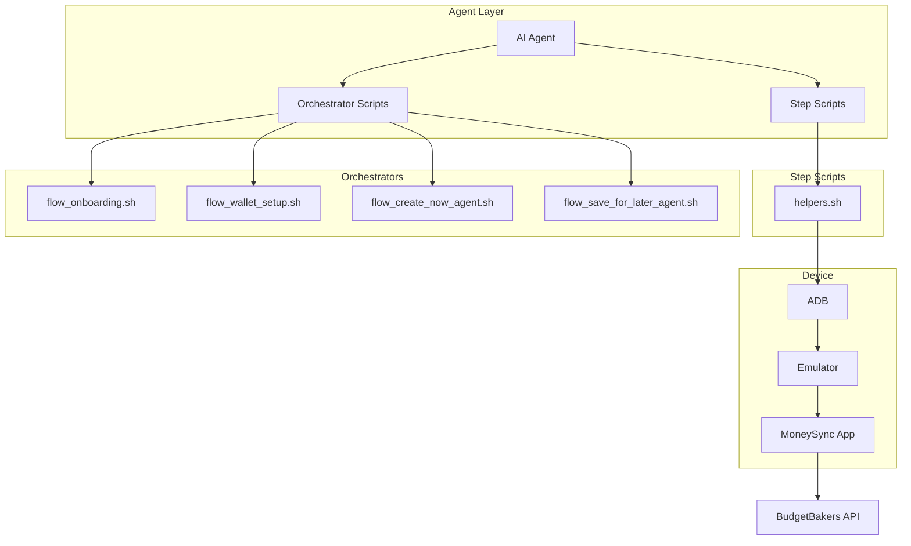
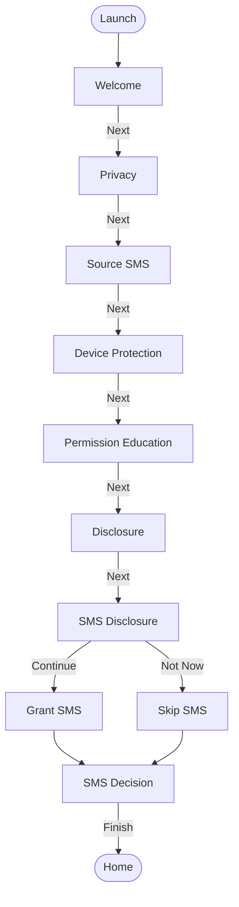
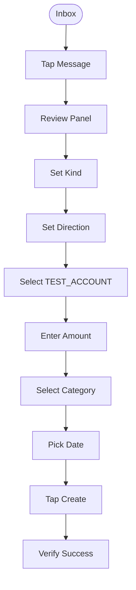
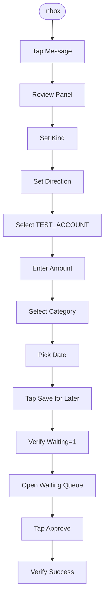
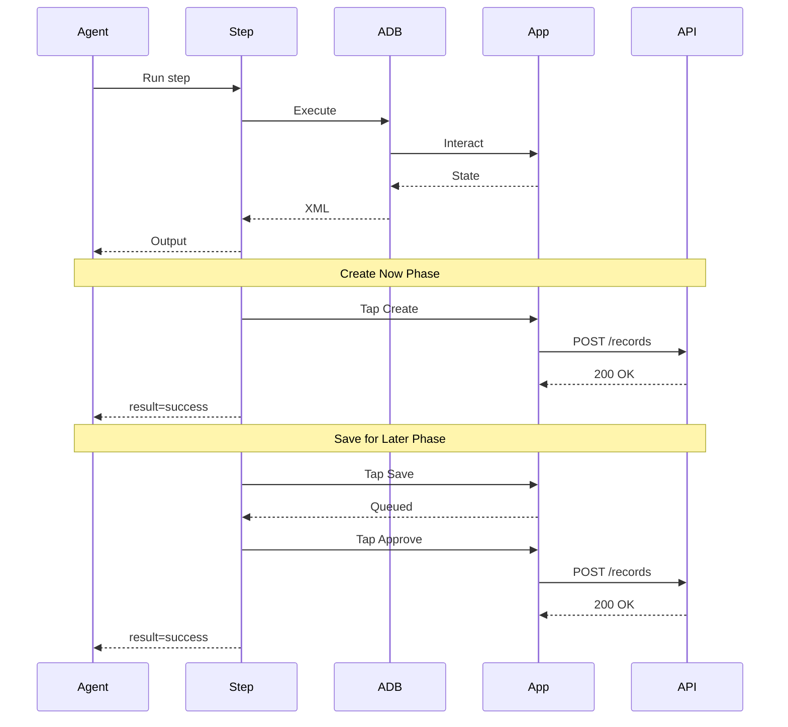
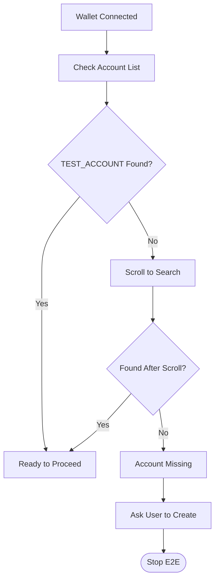
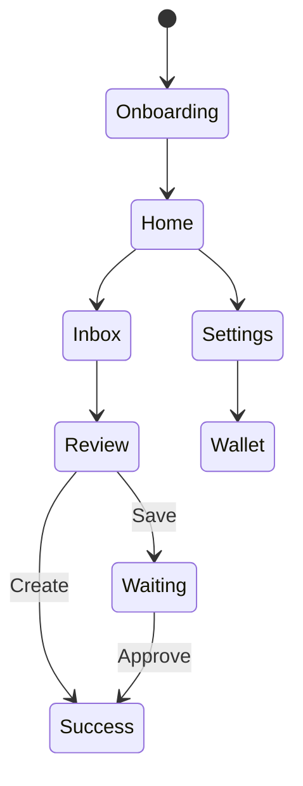

# MoneySync E2E Testing

End-to-end device testing for MoneySync via ADB. Tests the full flow from onboarding through wallet record creation on a real Android emulator.

## Directory Structure

```
e2e/
  agent/                          # Step scripts (agent-driven, structured output)
    helpers.sh                    # Shared library — ALL UI logic lives here
    step_app_launch.sh            # Launch app, detect screen
    step_screen_dump.sh           # Full screen state dump
    step_onboard_next.sh          # Tap Next on onboarding step
    step_onboard_sms_grant.sh     # Grant SMS permission during onboarding
    step_onboard_finish.sh        # Tap Finish on last onboarding step
    step_onboard_dismiss_review.sh  # Dismiss "Setup complete" page
    step_nav_tab.sh               # Navigate to bottom nav tab (canonical)
    step_nav_home.sh              # Navigate back to home
    step_nav_wallet.sh            # Navigate to Settings > Wallet Connection
    step_wallet_setup.sh          # Enter API token and connect wallet
    step_wallet_check.sh          # Check wallet + validate TEST_ACCOUNT exists
    step_sms_seed.sh              # Seed SMS on emulator
    step_import_ensure_sender.sh  # Ensure sender is tracked
    step_import_scan.sh           # Run history import scan
    step_inbox_open.sh            # Open inbox, list messages
    step_inbox_tap_message.sh     # Tap a message to open review
    step_read_dropdowns.sh        # Read all dropdowns (values, bounds, options)
    step_select_dropdown.sh       # Select dropdown option (scrolls if needed)
    step_review_read_fields.sh    # Read review panel field values
    step_review_select_account.sh # Select TEST_ACCOUNT in picker (uses helpers)
    step_review_create_now.sh     # Tap "Create record"
    step_review_save_for_later.sh # Tap "Save for later"
    step_waiting_approve.sh       # Open waiting queue, approve mutation
    step_home_counts.sh           # Get Review/Retry/Waiting/Success counts
    step_log_check.sh             # Search logs for patterns
    step_log_error.sh             # Read error log
    step_log_info.sh              # Read info log
    step_activity_check.sh        # Check activity log entries
  flow_onboarding.sh              # Orchestrator: complete onboarding
  flow_wallet_setup.sh            # Orchestrator: connect wallet
  flow_import_message.sh          # Orchestrator: import a message
  flow_create_now_agent.sh        # Orchestrator: full Create Now flow
  flow_save_for_later_agent.sh    # Orchestrator: full Save for Later flow
  flow_full_e2e.sh                # Orchestrator: all flows chained
  flow_negative.sh                # Negative test cases
  run_all.sh                      # Run all flows
```

## Prerequisites

- Android emulator running: `adb devices` → `emulator-5554 device`
- `privateFull` flavor installed with matching Dart entrypoint
- TEST_ACCOUNT wallet token (set in `flow_wallet_setup.sh` or env)

```bash
# Build and install
flutter build apk --debug --flavor privateFull --target lib/main_private_full.dart
adb install -r build/app/outputs/flutter-apk/app-privatefull-debug.apk
```

## Two Modes

### 1. Agent-Driven (Recommended)

Step scripts return structured output. The agent reads the output, decides the next action, and runs the next step.

```bash
# Check what's on screen
bash e2e/agent/step_screen_dump.sh

# Run a single step
bash e2e/agent/step_app_launch.sh

# Chain steps manually
bash e2e/agent/step_onboard_next.sh
```

### 2. Orchestrator (Full Flows)

Scripts that chain steps for complete automated flows:

```bash
# Full onboarding
bash e2e/flow_onboarding.sh sms_grant

# Connect wallet
bash e2e/flow_wallet_setup.sh YOUR_TOKEN

# Full Create Now (seed → import → inbox → review → create → verify)
bash e2e/flow_create_now_agent.sh SAMPATHTX

# Full Save for Later (seed → import → inbox → save → approve → verify)
bash e2e/flow_save_for_later_agent.sh SAMPATHTX

# Everything (onboarding + wallet + import + create + save)
bash e2e/flow_full_e2e.sh YOUR_TOKEN SAMPATHTX
```

## Quick Start: Full E2E from Scratch

```bash
cd money_sync/

# 1. Complete onboarding (grants SMS permission)
bash e2e/flow_onboarding.sh sms_grant

# 2. Connect wallet
bash e2e/flow_wallet_setup.sh "$WALLET_TOKEN"

# 3. Run Create Now flow
bash e2e/flow_create_now_agent.sh SAMPATHTX

# 4. Run Save for Later flow
bash e2e/flow_save_for_later_agent.sh SAMPATHTX
```

## Agent Usage Pattern

For an AI agent that reads screen state and decides actions:

```bash
# 1. Observe
bash e2e/agent/step_screen_dump.sh

# 2. Act
bash e2e/agent/step_onboard_next.sh

# 3. Verify
bash e2e/agent/step_screen_dump.sh

# 4. Repeat
```

Each step script outputs structured key=value pairs the agent can parse:
- `screen=home` / `screen=inbox` / `panel=review`
- `wallet_status=connected` / `wallet_status=disconnected`
- `test_account=found` / `test_account=missing`
- `action=tapped_next` / `result=success`
- `found=true` / `found=false`

## Agent Step Reference

### Screen & Navigation
| Script | Purpose | Key Output |
|--------|---------|------------|
| `step_screen_dump.sh` | Full screen state | `screen=`, `onboarding=`, `panel=` |
| `step_app_launch.sh` | Launch app | `screen=onboarding\|home\|lock` |
| `step_nav_tab.sh <tab>` | Switch tab | `navigated_to=inbox` |
| `step_nav_home.sh` | Return home | `screen=home` |

### Onboarding
| Script | Purpose | Key Output |
|--------|---------|------------|
| `step_onboard_next.sh` | Tap Next | `current_step=`, `action=tap_next` |
| `step_onboard_sms_grant.sh` | Grant SMS | `action=granted_via_adb` |
| `step_onboard_finish.sh` | Finish onboarding | `action=onboarding_complete` |
| `step_onboard_dismiss_review.sh` | Dismiss review | `screen=home` |

### Wallet
| Script | Purpose | Key Output |
|--------|---------|------------|
| `step_nav_wallet.sh` | Go to wallet page | `screen=wallet_connection` |
| `step_wallet_setup.sh [token]` | Enter token | `wallet_status=connected` |
| `step_wallet_check.sh` | Check status + TEST_ACCOUNT | `test_account=found\|missing` |

### Import
| Script | Purpose | Key Output |
|--------|---------|------------|
| `step_sms_seed.sh [sender] [body]` | Seed SMS | `sender=`, `body=` |
| `step_import_ensure_sender.sh [name]` | Check tracked senders | `status=already_listed` |
| `step_import_scan.sh` | Run history scan | `action=scan_complete` |

### Inbox & Review
| Script | Purpose | Key Output |
|--------|---------|------------|
| `step_inbox_open.sh` | Open inbox | `message_count=N` |
| `step_inbox_tap_message.sh [text]` | Tap message | `screen=review_panel` |
| `step_read_dropdowns.sh` | Read dropdowns | `dropdown=kind`, `current_value=`, `options=` |
| `step_select_dropdown.sh <dd> <opt>` | Select option | `status=selected`, `value=` |
| `step_review_read_fields.sh` | Read fields | `kind=`, `wallet_account=` |
| `step_review_select_account.sh` | Pick TEST_ACCOUNT | `account=TEST_ACCOUNT`, `status=selected` |
| `step_review_create_now.sh` | Create record | `result=success` |
| `step_review_save_for_later.sh` | Save for later | `result=queued` |
| `step_waiting_approve.sh` | Approve from waiting | `result=success` |

### Logs & Verification
| Script | Purpose | Key Output |
|--------|---------|------------|
| `step_home_counts.sh` | Dashboard counts | `{"review":N,"waiting":N,...}` |
| `step_log_check.sh [patterns]` | Search logs | `found=true/false` per pattern |
| `step_log_error.sh` | Error log | `status=clean\|has_errors` |
| `step_log_info.sh` | Info log | last 30 lines |
| `step_activity_check.sh` | Activity entries | `status=empty\|has_entries` |

## Dropdown Scripts

### Read all dropdowns on screen

```bash
bash e2e/agent/step_read_dropdowns.sh
```

Output shows each dropdown with current value, bounds, center, and options:
```
dropdown=kind
  current_value=expense
  bounds=[95,1165][985,1291]
  center=540,1228
  options=expense|income|transfer|refund
  hint=credited_sms=income, debited_sms=expense
```

### Select a dropdown option

```bash
bash e2e/agent/step_select_dropdown.sh kind income
bash e2e/agent/step_select_dropdown.sh direction credit
bash e2e/agent/step_select_dropdown.sh wallet_account TEST_ACCOUNT
bash e2e/agent/step_select_dropdown.sh category "All Income"
bash e2e/agent/step_select_dropdown.sh payment_type Cash
```

**Available dropdowns:** kind, direction, payment_type, wallet_account, category, date

### Field rules

| SMS Type | Kind | Direction |
|----------|------|-----------|
| Credited | income | credit |
| Debited | expense | debit |
| Transfer | transfer | neutral |

- Wallet account **must** be TEST_ACCOUNT (scrolls automatically to find it)
- Category must be selected
- Date must be picked
- Amount must be non-zero

## TEST_ACCOUNT

Default: `TEST_ACCOUNT`. The account picker scrolls to find it since it's
typically below the visible area.

`step_wallet_check.sh` validates TEST_ACCOUNT exists after wallet connect.
If missing, it outputs `test_account=missing` and tells you to create it.

Override with:
```bash
TEST_ACCOUNT_NAME="MyTestAccount" bash e2e/flow_create_now_agent.sh
```

## Helpers (agent/helpers.sh)

Source in custom scripts:
```bash
source "$(dirname "$0")/agent/helpers.sh"
```

### Navigation (canonical — use these instead of raw coords)
| Function | Purpose |
|----------|---------|
| `nav_tab NAME` | Navigate to tab (home/inbox/mappings/activity/settings) |
| `ensure_visible DESC [max]` | Scroll until element visible |
| `detect_screen` | Returns which screen/step is showing |

### UI State
| Function | Purpose |
|----------|---------|
| `ui_dump_xml` | Raw UI XML dump |
| `ui_check "text"` | Check if text exists (exit 0/1) |
| `ui_elements` | List all content-desc values |
| `ui_texts` | List all text values |
| `wait_for "text" [timeout] [poll]` | Poll until text appears |

### UI Interaction
| Function | Purpose |
|----------|---------|
| `find_bounds "desc"` | Find element bounds |
| `find_bounds_with_scroll "desc" [max]` | Find with scroll |
| `tap_bounds BOUNDS` | Tap center of bounds string |
| `tap_desc "desc"` | Tap element by content-desc |
| `tap X Y` | Tap coordinates |
| `scroll_down` / `scroll_up` | Scroll page |
| `go_back` | Press back |
| `type_text "text"` | Type into field |
| `clear_field` | Clear field |

### Account Selection
| Function | Purpose |
|----------|---------|
| `select_test_account [name]` | Select TEST_ACCOUNT (scrolls) |
| `check_test_account_exists` | Validate TEST_ACCOUNT in wallet |

### Logging
| Function | Purpose |
|----------|---------|
| `log_flutter [lines]` | Read Flutter logcat |
| `log_search "pattern"` | Search logs for pattern |
| `log_info` | Read app info log |
| `log_error` | Read app error log |

### State
| Function | Purpose |
|----------|---------|
| `get_home_counts` | Get dashboard counts |
| `home_counts_json` | Counts as JSON |
| `check_wallet_connected` | Check wallet status |

### Device
| Function | Purpose |
|----------|---------|
| `preflight` | Check device attached |
| `build_and_install` | Build and install APK |
| `launch` | Force-stop and start app |
| `grant_sms_permission` | Grant via adb |
| `seed_sms sender body` | Seed SMS on emulator |

## Flows

### Flow 1: Onboarding → Home

```
launch → welcome → privacy → source_sms → device_protection
→ permission_education → disclosure → sms_disclosure
→ sms_decision → finish → home
```

### Flow 2: Wallet Setup

```
settings → wallet_connection → enter_token → connecting → connected
→ validate TEST_ACCOUNT exists
```

### Flow 3: Import Message

```
seed_sms → ensure_sender_tracked → history_scan → scan_complete → inbox
```

### Flow 4: Create Now

```
seed_sms → history_scan → inbox → tap_message → review_panel
→ select_account(TEST_ACCOUNT) → create_record → success
→ verify: home_counts + logs + activity
```

### Flow 5: Save for Later

```
seed_sms → history_scan → inbox → tap_message → review_panel
→ select_account(TEST_ACCOUNT) → save_for_later → queued
→ waiting_queue → approve → success
→ verify: home_counts + logs + activity
```

## UI Coordinates (1080×2400 screen)

| Target | Constant | Value |
|--------|----------|-------|
| Home tab | `TAB_HOME_X/Y` | 135, 2232 |
| Inbox tab | `TAB_INBOX_X/Y` | 405, 2232 |
| Mappings tab | `TAB_MAPPINGS_X/Y` | 675, 2232 |
| Activity tab | `TAB_ACTIVITY_X/Y` | 945, 2232 |
| Settings gear | `SETTINGS_GEAR_X/Y` | 1017, 210 |

**Always use `nav_tab` instead of raw coordinates.**

## Reading Logs

```bash
# App info log
adb exec-out run-as me.namila.money_sync.privatefull sh -c "cat code_cache/logs/app/info.log"

# App error log
adb exec-out run-as me.namila.money_sync.privatefull sh -c "cat code_cache/logs/app/error.log"

# Live Flutter logcat
adb logcat -s flutter
```

## Evidence Capture

```bash
mkdir -p worklog/evidence
adb exec-out uiautomator dump /dev/tty > worklog/evidence/flow-home.xml
adb logcat -d > worklog/evidence/flow-logcat.txt
```

`screencap` returns black under FLAG_SECURE. Use uiautomator dumps.

## Flow Diagrams

> Full diagrams in `diagrams/` folder.

| Diagram | HTML (open in browser) | Mermaid (render in GitHub) |
|---------|----------------------|---------------------------|
| Architecture | [architecture.html](../diagrams/architecture.html) | [architecture.md](../diagrams/architecture.md) |
| Onboarding Flow | [flow-onboarding.html](../diagrams/flow-onboarding.html) | [flow-onboarding.md](../diagrams/flow-onboarding.md) |
| Create Now Flow | [flow-create-now.html](../diagrams/flow-create-now.html) | [flow-create-now.md](../diagrams/flow-create-now.md) |
| Save for Later Flow | [flow-save-for-later.html](../diagrams/flow-save-for-later.html) | [flow-save-for-later.md](../diagrams/flow-save-for-later.md) |
| Full E2E Sequence | [flow-full-e2e.html](../diagrams/flow-full-e2e.html) | [flow-full-e2e.md](../diagrams/flow-full-e2e.md) |
| Wallet Setup | — | [flow-wallet-setup.md](../diagrams/flow-wallet-setup.md) |
| Import Message | — | [flow-import-message.md](../diagrams/flow-import-message.md) |
| State Machine | — | [state-machine.md](../diagrams/state-machine.md) |

Open `.html` files in any browser for editorial-quality diagrams with branded typography and layout.

### Architecture Overview



### Onboarding Flow



### Create Now Flow



### Save for Later Flow



### Full E2E Sequence



### TEST_ACCOUNT Validation



### State Machine



## E2E Records

Records created by E2E tests include `[e2e]` in the note field and label `testing_e2e`.
Clean up: search BudgetBakers for `[e2e]` and delete.
